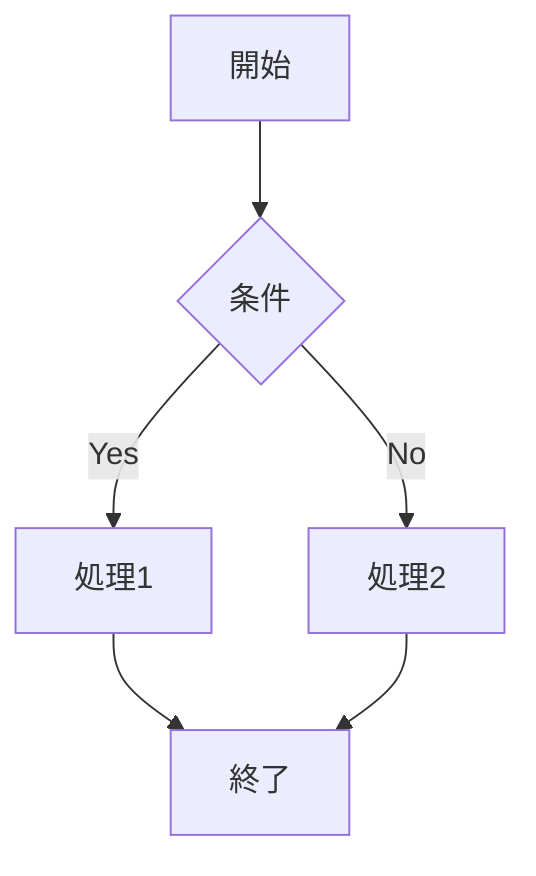

# コントリビューションガイド

理論計算機科学教科書への貢献をありがとうございます！このガイドでは、プロジェクトへの貢献方法について説明します。

## 🚀 クイックスタート

### 1. 開発環境のセットアップ

#### 前提条件
- Git
- Ruby 3.0以上
- Node.js 18以上

#### ローカル環境での開発

```bash
# 1. リポジトリをフォーク・クローン
git clone https://github.com/YOUR_USERNAME/theoretical-computer-science-textbook.git
cd theoretical-computer-science-textbook

# 2. 依存関係をインストール
npm run install:deps

# 3. 開発サーバーを起動
npm run dev

# ブラウザで http://localhost:4000 を開く
```

#### Docker を使用した開発（推奨）

```bash
# Docker Compose で開発環境を起動
docker-compose up

# ブラウザで http://localhost:4000 を開く
```

### 2. 開発ワークフロー

```bash
# 新しい機能ブランチを作成
git checkout -b feature/your-feature-name

# 変更を実装
# ...

# テストを実行
npm test

# 変更をコミット
git add .
git commit -m "feat: 新機能の説明"

# ブランチをプッシュ
git push origin feature/your-feature-name

# GitHub で Pull Request を作成
```

## 📝 コントリビューションの種類

### 1. コンテンツの改善
- **誤字・脱字の修正**: 小さな修正でも歓迎
- **説明の改善**: より分かりやすい説明への書き換え
- **例題の追加**: 理解を助ける具体例
- **図表の改善**: Mermaid図の追加・修正

### 2. 技術的改善
- **レイアウトの改善**: CSS/HTML の改善
- **パフォーマンス向上**: サイトの高速化
- **アクセシビリティ**: 使いやすさの向上
- **SEO最適化**: 検索エンジン対応

### 3. 新機能の追加
- **インタラクティブ要素**: 練習問題、クイズ
- **ナビゲーション改善**: より使いやすいUI
- **検索機能**: コンテンツ検索の強化

## 📋 ガイドライン

### コミットメッセージ

[Conventional Commits](https://www.conventionalcommits.org/) 形式を使用してください：

```
type(scope): description

例:
feat(chapter-1): 新しい例題を追加
fix(navigation): ページナビゲーションのバグを修正
docs(readme): インストール手順を更新
style(css): レスポンシブデザインを改善
```

#### コミットタイプ
- `feat`: 新機能
- `fix`: バグ修正
- `docs`: ドキュメント
- `style`: スタイル変更
- `refactor`: リファクタリング
- `test`: テスト
- `chore`: その他

### コードスタイル

#### Markdown
- 見出しは `#` 記法を使用
- リストは `-` を使用
- 行長は120文字以内
- 日本語と英語の間にスペースを挿入

#### 数式
- MathJax記法を使用: `$inline$` や `$$display$$`
- 複雑な数式は改行して見やすく

#### 図表
- **基本方針**: 学術品質のSVG図表を推奨
- **レガシー対応**: Mermaid記法も使用可能（グラフ、フローチャート、状態遷移図など）
- **専門的内容**: 理論計算機科学の図表には高品質なSVG図表を使用

##### SVG図表の作成ガイドライン

**ファイル命名規則**:
- `chX_図表内容の英語名.svg` （例: `ch5_complexity_class_inclusions.svg`）
- 章番号 + アンダースコア + 英語記述子
- ファイル名は英語、図表内テキストは日本語

**技術仕様**:
- viewBox寸法: 内容に応じて最適化（推奨: 800-1400px幅）
- フォント: Inter/Helveticaフォントスタック使用
- 色彩: アクセシビリティ対応（適切なコントラスト比）
- エンコーディング: UTF-8でUnicode対応

**アクセシビリティ要件**:
```svg
<svg role="img" aria-labelledby="title desc" xmlns="http://www.w3.org/2000/svg" viewBox="0 0 800 600">
  <title id="title">図表の日本語タイトル</title>
  <desc id="desc">図表の詳細な説明文</desc>
  <!-- 図表の内容をここに記述 -->
</svg>
```
- `role="img"` と `aria-labelledby="title"` 属性必須
- 数学記号や専門用語の適切な日本語化

**学術品質基準**:
- 論文・教科書レベルの視覚的品質
- 理論的概念の正確な視覚化
- 一貫したデザインスタイル
- 複雑な階層構造の明確な表現

### ファイル構成

```
docs/
├── src/
│   ├── chapter-X/
│   │   └── index.md          # 章のメインコンテンツ
│   ├── appendices/
│   │   └── X.md             # 付録コンテンツ
│   └── introduction/
│       └── *.md             # 導入部
├── _layouts/                # Jekyll レイアウト
├── _includes/               # 共通パーツ
├── assets/                  # CSS/JS/画像
│   ├── images/
│   │   └── diagrams/        # SVG図表ファイル
│   │       ├── chX_*.svg    # 章別図表
│   │       └── appendix_*.svg # 付録図表
│   ├── css/                 # スタイルシート
│   └── js/                  # JavaScript
└── package.json             # NPM設定
```

**図表ファイルの管理**:
- すべてのSVG図表は `docs/assets/images/diagrams/` に配置
- 章番号プレフィックスで整理（例: `ch1_`, `ch2_`）
- 付録図表は `appendix_` プレフィックス使用

## 🧪 テスト

### ローカルテスト

```bash
# Markdownの品質チェック
npm run lint

# スペルチェック
npm run spellcheck

# リンクチェック
npm run check-links

# ビルドテスト
npm run build
```

### 自動テスト

GitHub Actions が以下を自動実行します：
- Markdown linting
- スペルチェック
- リンクチェック
- ビルドテスト

## 📖 コンテンツガイド

### 章の構成

```markdown
---
title: "章タイトル"
layout: default
---

# 章タイトル

## 学習目標
- 目標1
- 目標2

## X.1 セクション1
### 定義
### 例題
### 練習問題

## X.2 セクション2
...

## まとめ

## 練習問題
1. 問題1
2. 問題2
```

### 数式の書き方

```markdown
インライン数式: $f(n) = O(n^2)$

ディスプレイ数式:
$$
\sum_{i=1}^{n} i = \frac{n(n+1)}{2}
$$
```

### 図表の書き方

```markdown

```

## 🔍 レビュープロセス

### Pull Request の要件

1. **明確な説明**: 何を変更したか、なぜ変更したか
2. **テストの通過**: すべての自動テストがパス
3. **スクリーンショット**: UI変更の場合は before/after
4. **関連Issue**: 該当する場合はIssue番号を記載

### レビュー基準

- **正確性**: 内容が学術的に正確
- **明確性**: 読者にとって理解しやすい
- **一貫性**: 既存のスタイルと一致
- **完全性**: 必要な情報がすべて含まれている

## 🐛 バグ報告

### Issue テンプレート

```markdown
## バグの説明
明確で簡潔な説明

## 再現手順
1. ページXに移動
2. ボタンYをクリック
3. エラーが発生

## 期待される動作
何が起こるべきだったか

## 環境
- OS: [e.g. Windows 10]
- ブラウザ: [e.g. Chrome 91]
- デバイス: [e.g. Mobile, Desktop]

## スクリーンショット
該当する場合は添付
```

## 🌟 機能要望

新機能のアイデアがある場合：

1. 既存のIssueを確認
2. 新しいIssueを作成
3. 詳細な説明と使用例を提供
4. 実装方法があれば提案

## 📚 参考資料

### 基本ツール
- [Jekyll Documentation](https://jekyllrb.com/docs/)
- [GitHub Pages Documentation](https://docs.github.com/en/pages)
- [MathJax Documentation](https://docs.mathjax.org/)
- [Mermaid Documentation](https://mermaid-js.github.io/mermaid/)

### SVG図表作成
- [SVG Specification](https://www.w3.org/TR/SVG2/) - W3C SVG仕様
- [SVG Accessibility Guidelines](https://www.w3.org/WAI/GL/WCAG20-TECHS/SVG.html) - アクセシビリティガイドライン
- [Japanese Typography Guidelines](https://www.w3.org/TR/jlreq/) - 日本語組版ガイドライン

### 学術図表のベストプラクティス
- **色覚バリアフリー**: ColorBrewer 2.0パレット推奨
- **フォント選択**: Inter/Helvetica（欧文）+ 游ゴシック/Noto Sans CJK（和文）
- **図表解像度**: ベクター形式で倍率非依存
- **多言語対応**: Unicode文字の適切な処理

## 💬 コミュニケーション

- **Issues**: バグ報告、機能要望
- **Discussions**: 質問、アイデア、フィードバック
- **Pull Requests**: コードレビュー、議論

## 🙏 謝辞

すべてのコントリビューターに感謝します！あなたの貢献が教育リソースの向上に役立っています。

---

質問がある場合は、お気軽にIssueを作成するか、Discussionsで質問してください。